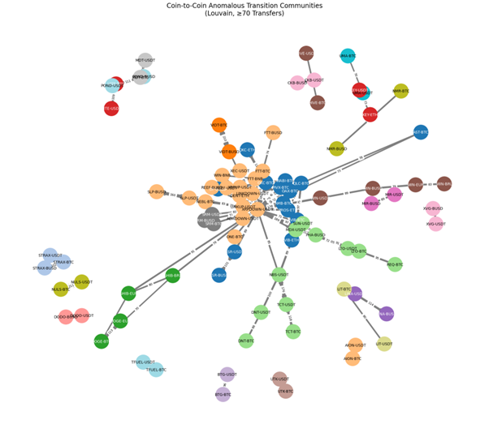
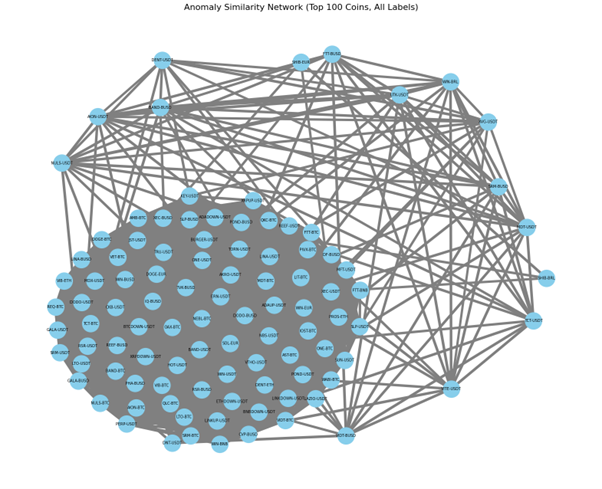

# 암호화폐 이상 거래 네트워크 분석

본 프로젝트는 암호화폐 시장에서 발생하는 이상 거래 패턴을 네트워크 관점에서 분석한 프로젝트입니다.  
이상 거래를 단순한 개별 사건으로 보지 않고, 서로 다른 코인 간에 시간적으로 어떻게 전이되고 연결되는지를 탐색하는 데 초점을 두었습니다.

Kaggle에서 수집한 1분 단위 암호화폐 거래 데이터를 바탕으로,  
이상치 탐지, 이상 거래 클러스터링, 전이 네트워크 분석, 커뮤니티 탐지,  
그리고 유사도 기반 네트워크 분석까지 하나의 Jupyter Notebook에서 수행하였습니다.

---

## 1. 프로젝트 개요

암호화폐 시장에서의 이상 거래는 독립적으로 발생하는 단일 이벤트가 아니라,  
특정 코인에서 시작되어 다른 코인으로 확산되는 구조를 가질 수 있습니다.

본 프로젝트는 다음과 같은 질문에서 출발합니다.

- 어떤 거래를 이상 거래로 볼 수 있는가?
- 이상 거래는 몇 가지 유형으로 구분될 수 있는가?
- 한 코인에서 발생한 이상 거래가 다른 코인으로 이어지는 패턴이 존재하는가?
- 전이 구조 속에서 중심적인 역할을 하는 코인 또는 클러스터는 무엇인가?
- 유사한 이상 거래 특성을 가진 코인들은 구조적으로 어떤 관계를 가지는가?

이를 위해 비지도 이상치 탐지 기법과 네트워크 분석 기법을 결합한 분석 프레임워크를 구성하였습니다.

---

## 2. 데이터셋

본 프로젝트는 Kaggle에서 수집한 암호화폐 거래 데이터를 사용합니다.

### 데이터 개요
- **총 종목 수:** 1000개
- **데이터 형식:** 종목별 `.parquet` 파일
- **시간 단위:** 1분 단위 거래 데이터
- **사용 기간:** 2022년 10월 1일 이후 약 1.5개월
- **전체 데이터 규모:** 54,554,643행

### 주요 변수
- `Open_time`: 거래 시작 시간
- `Open`: 시가
- `High`: 고가
- `Low`: 저가
- `Close`: 종가
- `Volume`: 거래량
- `Quote_asset_volume`: 상대 자산 기준 거래량
- `Number_of_trades`: 체결 횟수
- `Taker_buy_base_asset_volume`: 매수자 주도 거래량 (기초 자산 기준)
- `Taker_buy_quote_asset_volume`: 매수자 주도 거래량 (상대 자산 기준)
- `Symbol`: 코인 종목 코드

---

## 3. 분석 과정

### 3.1 파생 변수 생성

이상 거래 탐지를 위해 다음과 같은 파생 변수를 생성하였습니다.

- **Price_change**: 종가 기준 비율 변화율
- **Vol_z**: 거래량의 z-score 정규화 값
- **Volatility**: `(high - low) / open` 기반 변동성 비율

### 3.2 이상치 탐지

비지도 이상치 탐지 기법인 **Isolation Forest**를 활용하여 이상 거래를 탐지하였습니다.

- **Contamination:** 0.01
- 상위 1%를 이상치로 간주

이후 지나치게 극단적인 값의 영향을 줄이기 위해  
추가적으로 **IQR 필터링**을 적용하여 이상치를 한 번 더 정제하였습니다.

### 3.3 이상 거래 클러스터링

탐지된 이상 거래를 구조적으로 해석하기 위해 **K-Means 클러스터링**을 적용하였습니다.

- 입력 변수: `price_change`, `vol_z`, `volatility`
- 최적 클러스터 수: **K = 5**

각 클러스터는 다음과 같이 해석하였습니다.

- **Cluster 0 — 잠복형**  
  외형적으로는 미미하지만 이상치로 탐지된 거래

- **Cluster 1 — 가격 이탈형**  
  가격 하락과 함께 이탈하는 듯한 거래 패턴

- **Cluster 2 — 충격형**  
  가격의 급격한 변화 중심의 단기 이상 거래

- **Cluster 3 — 매집형**  
  거래량은 높지만 가격 변화는 크지 않은 반복 매매 형태

- **Cluster 4 — 은밀형**  
  가격은 조용하지만 거래 방향성이 조금씩 누적되는 형태

### 3.4 전이 분석

이상 거래가 다른 코인으로 시간적으로 이어지는지를 파악하기 위해  
**5분 이내 발생한 이상 거래쌍**을 기준으로 전이 분석을 수행하였습니다.

분석 항목은 다음과 같습니다.

- 동일 클러스터 내 전이 분석
- 클러스터 간 전이 분석
- 코인 간 전이 빈도 기반 네트워크 분석

이를 통해 이상 거래가 단일 코인에서 끝나는 것이 아니라  
다른 코인으로 연결되고 확산되는 구조를 확인하고자 하였습니다.

### 3.5 커뮤니티 탐지

전이 네트워크 내부의 하위 구조를 파악하기 위해  
**Louvain 알고리즘**을 이용하여 커뮤니티를 탐지하였습니다.

이를 통해 이상 거래가 자주 전이되는 코인 집단과  
국소적으로 결속된 하위 네트워크를 식별할 수 있었습니다.

### 3.6 유사도 기반 네트워크 분석

단순한 전이 관계를 넘어,  
코인별 이상 거래 특성 자체의 유사성을 기준으로 네트워크를 구성하였습니다.

코인별 특성을 벡터화한 뒤 코사인 유사도를 계산하였고,  
유사도가 높은 코인들만 연결하여 구조적 유사 관계를 시각화하였습니다.

---

## 4. 주요 결과

- 이상 거래는 독립적인 사건이 아니라 **연결된 구조 속에서 전이**되는 경향을 보였습니다.
- 일부 코인은 여러 전이 경로의 중심에서 **허브 역할**을 수행하였습니다.
- 이상 거래는 몇 가지 대표적인 패턴으로 **군집화**될 수 있었습니다.
- 특정 클러스터는 다른 클러스터보다 더 높은 **전이 위험도**를 보였습니다.
- 유사한 이상 거래 특성을 가진 코인들은 실제 네트워크 상에서도 밀접하게 연결되었습니다.

---

## 5. 결과 미리보기

### Figure 1. 코인 간 이상 거래 전이 커뮤니티
이상 거래가 5분 이내 다른 코인으로 이어진 전이 관계를 기반으로 구성한 네트워크입니다.  
Louvain 커뮤니티 탐지를 적용하여, 이상 거래가 특정 코인 집단 내부에서 반복적으로 전이되는 구조를 시각화하였습니다.



### Figure 2. 이상 거래 유사도 네트워크
상위 100개 코인에 대해 이상 거래 특성의 유사도를 계산하고,  
코사인 유사도 기준으로 연결한 네트워크입니다.  
유사한 이상 거래 패턴을 공유하는 코인들이 어떤 구조를 이루는지 보여줍니다.



---

## 6. 노트북 구성

본 프로젝트의 전체 분석 과정은 하나의 Jupyter Notebook에 정리되어 있습니다.

- `crypto_network_analysis.ipynb`

노트북에는 다음과 같은 과정이 순차적으로 포함되어 있습니다.

1. 데이터 로딩 및 병합  
2. 파생 변수 생성  
3. Isolation Forest 기반 이상치 탐지  
4. K-Means 기반 이상 거래 클러스터링  
5. 전이 네트워크 생성 및 시각화  
6. Louvain 커뮤니티 탐지  
7. 유사도 기반 네트워크 분석  

---

## 7. 사용 기술

- Python
- Pandas / NumPy
- Scikit-learn
- NetworkX
- Matplotlib / Seaborn
- python-louvain

---

## 8. 실행 방법

```bash
pip install -r requirements.txt
jupyter notebook
